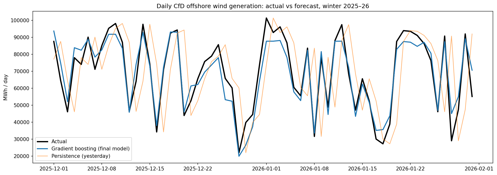
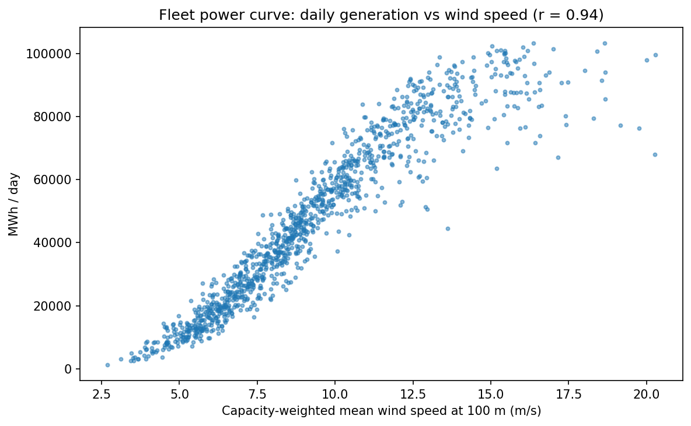

# Forecasting CfD Offshore Wind Generation

How well can daily generation from the UK's Contract for Difference (CfD) offshore wind fleet be predicted from weather data, and what explains the days when the forecast goes wrong?

**Headline result:** a gradient boosting model using hub-height wind speed cut forecast error by **74%** compared with a persistence benchmark, with a mean absolute error of **9.6% of average daily output** over a full held-out year (September 2025 to August 2026).



---

## Data

| Source | What | How |
|---|---|---|
| [LCCC Data Portal](https://dp.lowcarboncontracts.uk) – *Actual CfD Generation and avoided GHG emissions* | Daily CfD-eligible generation, payments, strike and reference prices for 86 CfD units, 2016–2026 (116,686 rows) | CKAN datastore API, paged |
| [Open-Meteo Historical Weather API](https://open-meteo.com) | Hourly wind speed at 100 m (hub height) for seven wind farm locations | REST API |
| LCCC Data Portal – *IMRP Actuals* | Hourly Intermittent Market Reference Price | CKAN datastore API |

## Method

**1. Build a stable fleet.** Total CfD generation grows as new farms commission, which would teach a model a trend unrelated to weather. I fixed the fleet to the **17 offshore wind units (7 farms)** whose CfDs started at least 90 days before July 2023, and analysed 1 July 2023 to 31 August 2026. The 90-day buffer excludes farms still ramping up.

**2. Clean and check the data.**
- No duplicate unit-days, missing generation or negative values.
- All 4,219 missing capture prices fall on zero-generation days, where a generation-weighted price is undefined. They are not errors.
- CfD start dates differ from construction dates. Moray East and Hornsea 2 generated from 2022, but their CfD data begins in March 2024. The dataset measures *contract-eligible* generation, not physical output.
- The final two weeks were excluded, because recent settlement and weather data may be provisional. Two anomalous days (high generation, low wind) fell in that period.

**3. Weather features.** Hourly 100 m wind was pulled for each farm and weighted by capacity. Each unit's best-ever day was used as a capacity proxy, which reproduces known farm sizes (for example, about 1.3 GW for Hornsea 2). One site whose grid cell showed coastal wind speeds was moved offshore. Daily features:
- `wind`: weighted mean wind speed
- `wind3`: weighted mean of *hourly* cubed wind speed, which captures intraday variability
- `doy_sin`, `doy_cos`: time of year, encoded cyclically

**4. Evaluation.** Time-based split, trained on the past and tested on a full unseen year so every season is covered. Metrics: MAE, RMSE, and skill against persistence.



## Results

Test period: September 2025 to August 2026 (mean daily generation about 51,300 MWh).

| Model | MAE (MWh) | MAE % of mean | Skill vs persistence |
|---|---|---|---|
| Same day last week | 27,893 | 54.4% | −0.47 |
| Climatology (monthly mean) | 20,935 | 40.8% | −0.11 |
| Persistence (yesterday) | 18,932 | 36.9% | 0.00 |
| Linear regression: wind | 7,038 | 13.7% | 0.63 |
| Linear regression: wind + wind² | 6,365 | 12.4% | 0.66 |
| Gradient boosting, 6 features, 2 years' training | 5,509 | 10.7% | 0.71 |
| Gradient boosting, 4 features, 2 years' training | 5,615 | 10.9% | 0.70 |
| **Gradient boosting, 4 features, 2024–25 training** | **4,905** | **9.6%** | **0.74** |

## Findings

1. **The input mattered more than the algorithm.** Adding wind speed to a straight line removed 63% of persistence error. Curvature and gradient boosting added a further 10–13% each.
2. **The cube law only holds below rated speed.** Cubing the daily mean wind speed was a *weaker* predictor (r = 0.81) than the mean itself (r = 0.94), because output plateaus once turbines reach rated power. However, the mean of *hourly* cubed wind added information alongside the mean, by distinguishing steady days from gusty ones.
3. **Yesterday's output adds nothing once today's wind is known.** Persistence only works as a proxy for weather. Permutation importance for lagged generation was about zero.
4. **A traceable distribution shift.** The model under-forecast windy days in the test year by up to about 5,400 MWh. Comparing output within wind-speed bands showed high-wind output rose about 6,000 MWh/day after 2023–24, and about 80% of that came from **Hornsea 1**, which ran at roughly 68% of its peak on windy days in 2023–24 against about 86% afterwards. Training only on the recent regime cut MAE by 13%, despite using half the data.
5. **Market conditions affect output, not just weather.** The largest over-forecast (13 June 2026: 75,900 MWh forecast, 53,000 actual) fell on a windy summer Saturday with nine consecutive hours of negative prices. CfD negative-pricing rules differ by contract: the 2014 Investment Contracts, about 70% of this fleet, are unaffected, while AR1–3 contracts receive no payment after six consecutive negative hours. The rules alone therefore can't explain the full shortfall, and curtailment or operator response to negative prices are likely contributors.

## Limitations

- **Observed wind was used as a perfect weather forecast.** A real day-ahead system would use forecast wind, so these errors are a lower bound.
- Results come from a single test year and one fleet definition.
- Causes of the Hornsea 1 shortfall (outages, cable faults or curtailment) cannot be determined from this data.

## Next steps

- Replace observed wind with archived day-ahead weather forecasts.
- Add day-ahead price features, such as the number of negative-price hours. Prices are known before delivery, so this is a legitimate input.
- Keep the full training history but exclude or flag Hornsea 1's affected period, rather than discarding a whole year.
- Produce probabilistic forecasts (quantiles), since error grows sharply on the steep part of the power curve.

## Repository

```
cfd_wind_forecast.ipynb   # full analysis, runs top to bottom in Google Colab
images/                   # figures used in this README
```
